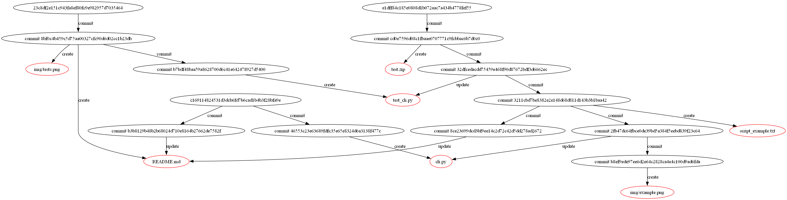

# Конфигурационное управление

# Домашнее задание №2

**Вариант №6**

Разработать инструмент командной строки для визуализации графа зависимостей, включая транзитивные зависимости. Сторонние средства для получения зависимостей использовать нельзя.

Зависимости определяются для git-репозитория. Для описания графа зависимостей используется представление Graphviz. Визуализатор должен выводить результат в виде сообщения об успешном выполнении и сохранять граф в файле формата png.

Построить граф зависимостей для коммитов, в узлах которого находятся
связи с файлами и папками, представленными уникальными узлами. Граф
необходимо строить для ветки с заданным именем.
Конфигурационный файл имеет формат ini и содержит:

* Путь к программе для визуализации графов.
* Путь к анализируемому репозиторию.
* Путь к файлу с изображением графа зависимостей.
* Имя ветки в репозитории.

Все функции визуализатора зависимостей должны быть покрыты тестами.

# Зависимости

Для корректной работы программы необходимо в config.ini указать:

1. Путь к программе для визуализации графов.
2. Путь к анализируемому репозиторию.
3. Путь к файлу с изображением графа зависимостей.
4. Имя ветки в репозитории.

Также необходим скачать расширения c помощью команды pip install, указанные в requirements.txt.

# Команда для запуска проекта
```
python main.py
```
# Команда для запуска юнит-тестов
```
python pytest tests/
```
**!Внимание!** Перед запуском в юнит-тестах необходимо указать пути:

1. test_config_loader.py
   
   * Путь к программе для визуализации графов.
   * Путь к анализируемому репозиторию.
   * Путь к файлу с изображением графа зависимостей.
   * Имя ветки в репозитории.
    
2. test_dependency_graph.py

 * В методе setUp():

   * Путь к программе для визуализации графов.
   * Путь к анализируемому репозиторию.
   * Путь к файлу с изображением графа зависимостей.
   * Имя ветки в репозитории.

 * В методе test_run():

   * Путь к файлу с изображением графа зависимостей.

3. test_git_helper.py

   * Путь к анализируемому репозиторию.

# Результат юнит-тестов программы


# Результат работы программы


